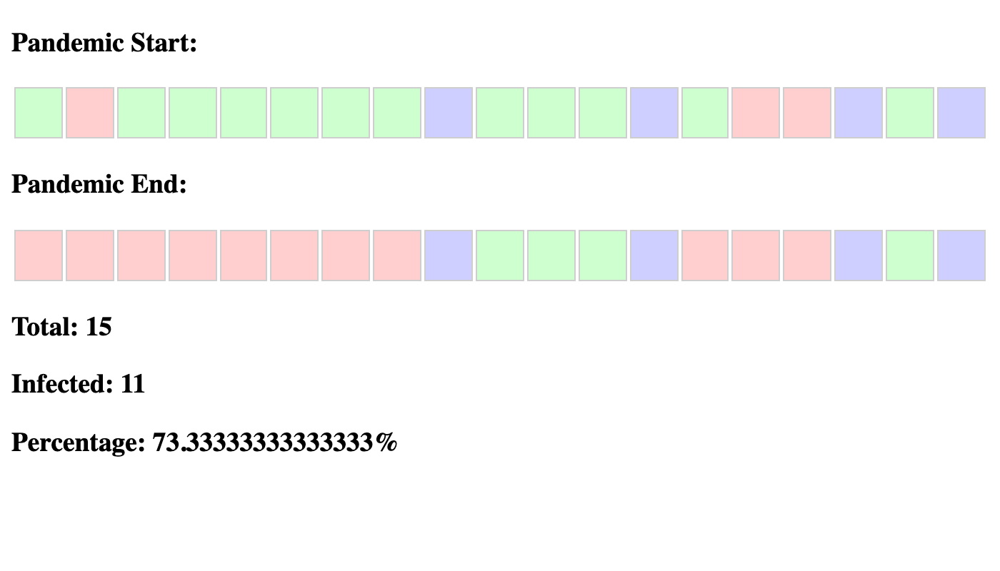

# In the world of quarantine!

## Beginning

The sea isolates each continent, but infected people have spread even before the warning.
You have a map of the world at the beginning of the pandemic:

```js
const pandemicStartMap = "XX0X10010X000X010X0";
```

A map is a string that contains three types of characters:

```
0 - uninfected
1 - infected
Х - ocean
```

## Rules

* The virus cannot spread to the other side of the ocean;
* If one person is infected, everyone on this continent is infected;
* Your task - to find the percentage of the population that eventually became infected.
* ❗❗ The first and last continents are not connected!

## Task

You need to display the result on the page as:

* Map before infection;
* Map after infection;
* The total number of infected areas on the map (excluding the ocean);
* Infected count;
* Percentage of infection.

## Example

```js
const pandemicStartMap = "01000000X000X011X0X";
```


